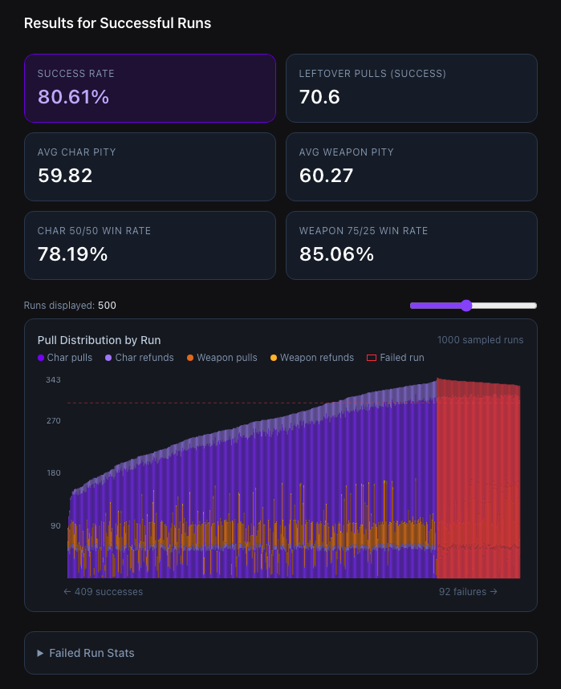
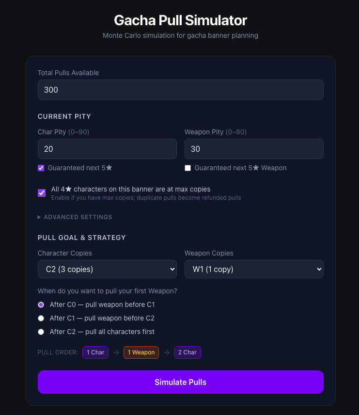
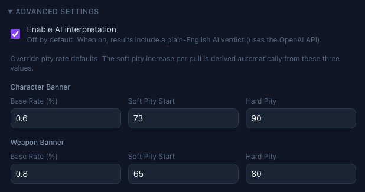
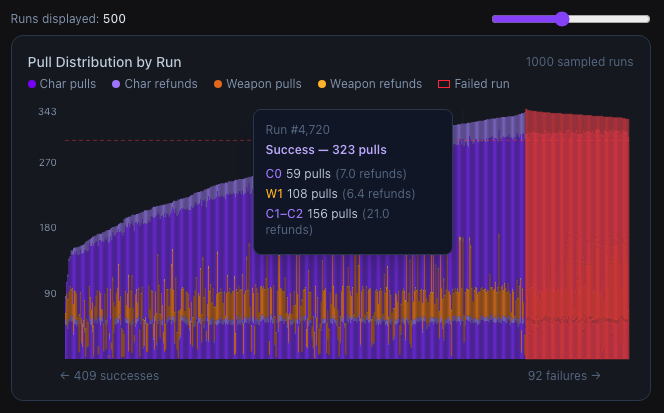
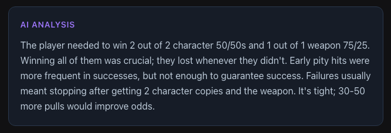
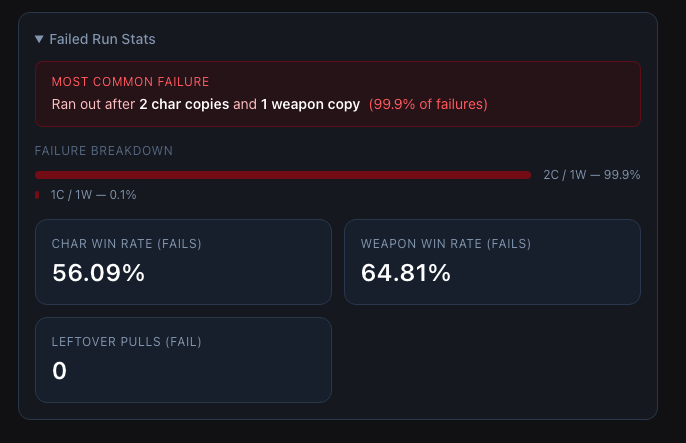

# Gacha Pull Simulator

A Monte Carlo planning tool for gacha games. Just tell it: 
- How many pulls you have
- Your current pity
- Pull goals (num. characters and/ or weapons) and select the strategy (prioritize all character copies before attempting pulls on the weapon, pull the first character copy followed by the weapon and then pull two more character copies, etc.)
After which, it will run 10,000 simulated attempts and tells you your odds of success, what a typical failure looks like, and a blunt, plain-English AI verdict on whether your goal is realistic.

Game-agnostic by design: the pity curves are fully configurable, so the same engine
models a wide range of gacha games built around dual-banner (character + weapon)
systems.

> **▶ Live demo: [gacha-pull-planner.vercel.app](https://gacha-pull-planner.vercel.app)**
> _The backend runs on a free tier and sleeps when idle, so the first Simulate after a quiet period can take ~30–60s to wake — subsequent runs are instant._



---

## The product story

**Problem.** Gacha players spend real money and months of saved currency chasing
limited banners, but the systems are deliberately opaque: layered pity, 50/50 and
75/25 coin-flips, soft-pity ramps. "Do I have enough to get what I want?" is difficult for players to answer for themselves when trying to budget for other upcoming characters, and existing tools mostly answer "here's the average pity," which doesn't tell you your actual odds or what to do if you're short.

**Who it's for.** Players planning a specific pull goal ("2 copies of the character
plus their signature weapon") who want a confidence level and a strategy. This way, they can responsibly plan out their pulling strategy based on how likely they are to obtain their goals against what team setups they would like to form.

**What it does differently.**
- **Distributions, not averages.** It reports a *success rate* across 10,000 trials
  and the most common *failure states* ("you ran out after 1 of 2 characters, 30% of
  the time"). This is the information you actually need to decide whether to pull now or wait.
- **Strategy-aware.** Pull order matters because pity carries across a banner. The
  tool models an ordered strategy (e.g. character → weapon → character) rather than
  treating goals as independent. The model is also able to consider pity for "refunds" from obtaining the 4-star characters on the banner that are already maxed out.
- **An optional verdict, in plain English.** Opt in and the stats are piped through an
  LLM prompt tuned to answer: *Is this doable, tight, or a bit of a stretch goal?
  And how many more pulls would close the gap?* It's **off by default** (via
  Advanced Settings), so the core simulation and chart run faster.

**Key product/technical decisions.**
- Chose **Monte Carlo simulation** over a closed-form probability model: the pity +
  guarantee + refund interactions are painful to express analytically but trivial to
  simulate, and simulation naturally yields the full outcome distribution.
- Made pity rates **configurable** rather than hard-coding for any particular game a 
  deliberate scope expansion to broaden the audience beyond any single title.
- Kept the simulation core **pure and framework-free** so it's testable in isolation
  and reusable outside the web app.

**Roadmap.** 
1. *QoL: Expanded structure coverage and shareable result links.* Add more options for different types of banners and 50/50 loss structures; replacing the LLM verdict with a templated summary rather than leaving it unstructured.
2. *Feat: Shareable Pull Results.* Create a system for temporarily logging pull results according to a given session ID so users can refer back to/ share their results. Alternatively, create export for users to accomplish the same thing.
3. *Feat: Pull Projection.* Allowing users to enter their in-game currency accrual schedule, resulting in a pull amount calculation that can be pipelined into the simulator.

---

## Screenshots

**Scenario Setup:** Pulls, current pity, the 4★-refund flag, and an ordered
character/weapon pull strategy:



**Configurable Pity:** Override base rate, soft-pity start, and hard pity per banner
to match any game (this is what makes the engine game-agnostic):



**Pull-Distribution Chart:** Every sampled run as a stacked bar (successes on the
left, failures on the right), with a per-phase breakdown on hover:



**Optional AI Verdict:** A blunt, plain-English read on your odds (opt-in, off by
default):



**Failure Analysis:** The most common ways a run falls short:



---

## Architecture

```
React + Vite frontend  ──POST /analyze──▶  FastAPI backend
  (form, chart, results)                     ├─ simulation.py  (Monte Carlo engine, pure)
                                             └─ analyzer.py    (LLM natural-language verdict)
```

- **`simulation.py`** — the engine. Runs 10,000 trials of an ordered pull strategy,
  modeling soft/hard pity, 50/50 & 75/25 outcomes, guarantees, and 4★ refunds. Pure
  functions, no I/O.
- **`main.py`** — FastAPI app exposing a single `POST /analyze` endpoint.
- **`analyzer.py`** — turns the aggregated stats into a short plain-English analysis
  via the OpenAI API.
- **`frontend/`** — React 19 + Vite + Tailwind UI, with a Recharts pull-distribution
  visualization.

## Tech stack

| Layer | Tools |
|-------|-------|
| Backend | Python, FastAPI, Pydantic, NumPy, pandas |
| Frontend | React 19, Vite, Tailwind CSS v4, Recharts |
| AI | OpenAI Chat Completions |
| Tooling | oxlint, pytest |

---

## Quick start

The app is two processes: the FastAPI backend (port 8000) and the Vite frontend
(port 5173), which calls the backend.

The backend lives in [`backend/`](backend/) and the frontend in [`frontend/`](frontend/).

**1. Backend** — from `backend/`:

```bash
cd backend
pip install -r requirements.txt
echo "OPENAI_API_KEY=sk-..." > .env      # optional — only needed if you enable the AI verdict
uvicorn main:app --reload
```

Interactive API docs are then available at http://localhost:8000/docs (Swagger UI).

**2. Frontend** — in a second terminal:

```bash
cd frontend
npm install
npm run dev
```

Open the URL Vite prints (http://localhost:5173) and click **Simulate**.

---

## API reference

### `POST /analyze`

Runs the simulation and returns aggregated stats plus an AI analysis.

**Request body**

```json
{
  "total_pulls": 180,
  "start_char_pity": 30,
  "start_char_guarantee": true,
  "start_weapon_pity": 10,
  "start_weapon_guarantee": false,
  "strategy": [
    { "banner": "char",   "copies": 1 },
    { "banner": "weapon", "copies": 1 },
    { "banner": "char",   "copies": 1 }
  ],
  "full_4star_chars": true,
  "enable_ai_analysis": false,
  "char_pity_config":   { "base_rate": 0.006, "soft_pity_start": 73, "hard_pity": 90 },
  "weapon_pity_config": { "base_rate": 0.008, "soft_pity_start": 65, "hard_pity": 80 }
}
```

| Field | Type | Description |
|-------|------|-------------|
| `total_pulls` | int | Total pulls available |
| `start_char_pity` | int | Current pity on the character banner |
| `start_char_guarantee` | bool | Next 5★ character is guaranteed the featured one (no 50/50) |
| `start_weapon_pity` | int | Current pity on the weapon banner |
| `start_weapon_guarantee` | bool | Next 5★ weapon is guaranteed the featured one (no 75/25) |
| `strategy` | array | **Ordered** phases: each `{ "banner": "char" \| "weapon", "copies": int }`. Order matters — pity carries across phases. |
| `full_4star_chars` | bool | If true, duplicate 4★ characters are treated as refunded pulls |
| `enable_ai_analysis` | bool | Default `false`. If true, runs the OpenAI verdict and populates `analysis_text`; otherwise the analyzer is skipped (no API call) and `analysis_text` is `null` |
| `char_pity_config` | object | `base_rate`, `soft_pity_start`, `hard_pity` for the character banner |
| `weapon_pity_config` | object | Same three fields for the weapon banner |

**Response (abridged)**

```json
{
  "analysis_text": "You need to win both 50/50s...",
  "trials": 10000,
  "stats_summary": {
    "success_rate": "46.75%",
    "avg_pity_char": 74.2,
    "avg_pity_weapon": 69.8,
    "successes_char_win_rate": "89.00%",
    "successes_weapon_win_rate": "83.00%",
    "avg_leftover_pulls_on_success": 6.3,
    "avg_refund_success": 4.0,
    "failure_char_win_rate": "47.00%",
    "failure_weapon_win_rate": "42.00%",
    "avg_leftover_pulls_on_failure": 2.1,
    "avg_refund_fail": 3.0,
    "most_common_failure_state": { "chars": 1, "weapons": 0, "pct": 31.2 },
    "failure_state_distribution": [ { "chars": 1, "weapons": 0, "pct": 31.2 } ],
    "correlation_stats": { "total_successes": 4675, "total_failures": 5325 },
    "viz_sample": [ { "trial": 1, "success": true, "total_pulls_used": 172, "phases": [] } ]
  }
}
```

| Field | Type | Description |
|-------|------|-------------|
| `analysis_text` | string\|null | LLM-generated plain-English verdict; `null` unless `enable_ai_analysis` was `true` |
| `trials` | int | Number of Monte Carlo trials (10,000) |
| `success_rate` | string | % of trials that met the full goal |
| `avg_pity_char` / `avg_pity_weapon` | float | Avg pity at which the 5★ hit, on successful runs |
| `successes_*_win_rate` / `failure_*_win_rate` | string | 50/50 (char) and 75/25 (weapon) win rates, split by outcome |
| `avg_leftover_pulls_on_success` / `_on_failure` | float | Pulls left over |
| `avg_refund_success` / `avg_refund_fail` | float | Avg pulls refunded from duplicate 4★s |
| `most_common_failure_state` | object\|null | Most frequent shortfall among failed runs |
| `failure_state_distribution` | array | Top failure shortfalls with percentages |
| `correlation_stats` | object | Success/failure counts broken down by contributing factors |
| `viz_sample` | array | Per-run phase breakdown sampled for the distribution chart |

Errors return `500` with a `{ "detail": "..." }` body.

---

## Testing

```bash
pip install pytest httpx
pytest
```

Covers the simulation output structure, the analyzer (mocked), and the `/analyze`
endpoint contract (both the AI-enabled and default AI-disabled paths, mocked).

---

## Deployment

The app deploys as two pieces: the FastAPI backend on **Render** and the static
React/Vite frontend on **Vercel**, both on free tiers. Config lives in
[`render.yaml`](backend/render.yaml) and [`frontend/vercel.json`](frontend/vercel.json); see
**[DEPLOY.md](DEPLOY.md)** for the step-by-step (deploy order, `ALLOWED_ORIGINS` ↔
`VITE_API_URL` wiring, and cost notes).

The AI verdict is off by default, but can be turned on and cost limits are set to prevent call exploitation/ abuse. In the event rate-limiting is triggered, a fallback of the AI verdict being hidden has been implemented.

---

## Notes & limitations

- The AI verdict is **opt-in and off by default**. `/analyze` only calls the OpenAI
  API when `enable_ai_analysis` is `true`; the simulation, stats, and chart never
  require a key. The OpenAI key lives in `.env` (gitignored); never commit it. If you
  expose a public demo with the AI verdict enabled, set a spend cap on your OpenAI key.
- Pity/guarantee/refund rates model common gacha systems but are simplifications;
  tune the pity configs to match a specific game.
